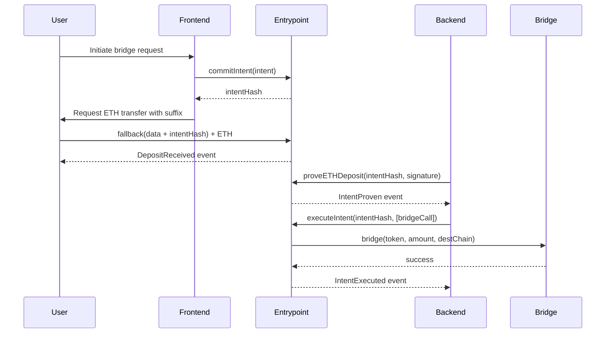
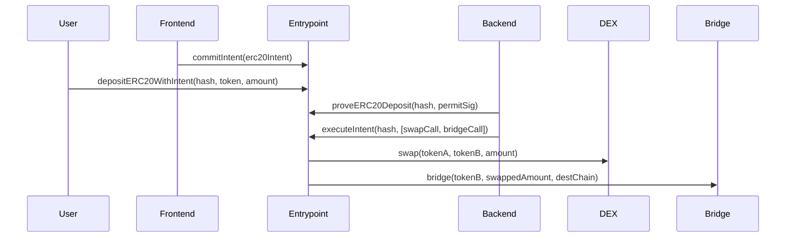

# TrailsEntrypointV2 Technical Specification

## Overview

TrailsEntrypointV2 is a revolutionary single entrypoint contract that enables 1-click crypto transactions by accepting intents through ETH/ERC20 transfers with calldata suffixes. It implements a commit-prove pattern that eliminates the traditional approve step, inspired by Relay's suffix pattern and Klaster's transaction validation approach.

## Architecture

### Core Innovation

The contract combines:
- **Single Entrypoint**: All intents flow through one contract
- **Transfer Suffix Pattern**: ETH/ERC20 transfers carry intent hash in calldata suffix
- **Commit-Prove Pattern**: Two-phase validation eliminating approve step
- **Intent-Based Architecture**: Generic cross-chain operations via structured intents

### Key Components

1. **Intent Management**: EIP-712 structured intent hashing with nonce-based anti-replay
2. **Deposit Handling**: ETH via fallback function, ERC20 via dedicated functions
3. **Proof Validation**: On-chain transaction validation using signature proofs
4. **Generic Execution**: Arbitrary multicall support for bridges, swaps, and DeFi operations
5. **Safety Mechanisms**: Emergency withdrawals, intent expiration, and pause functionality

## Technical Specification

### Contract Details

```solidity
// SPDX-License-Identifier: MIT
pragma solidity ^0.8.18;

contract TrailsEntrypointV2 is ReentrancyGuard {
    // Inherits from OpenZeppelin's ReentrancyGuard for protection
}
```

### Core Data Structures

#### Intent Structure
```solidity
struct Intent {
    address sender;              // Intent originator
    address token;               // Token address (address(0) for ETH)
    uint256 amount;              // Amount to transfer
    uint256 destinationChain;    // Target chain ID
    address destinationAddress;  // Recipient on destination chain
    bytes extraData;             // Additional operation data
    uint256 nonce;               // Anti-replay nonce
    uint256 deadline;            // Intent expiration timestamp
}
```

#### Deposit State Tracking
```solidity
struct DepositState {
    address owner;               // Deposit owner
    address token;               // Token address
    uint256 amount;              // Deposit amount
    uint8 status;                // Current status (0-3)
    Intent intent;               // Associated intent
    uint256 timestamp;           // Deposit timestamp
    bytes32 commitmentHash;      // Commitment hash
}

enum IntentStatus {
    Pending,    // 0: Intent committed, awaiting deposit
    Proven,     // 1: Deposit proven, ready for execution
    Executed,   // 2: Successfully executed
    Failed      // 3: Failed or expired
}
```

#### Execution Calls
```solidity
struct Call {
    address target;    // Contract to call
    bytes data;        // Call data
    uint256 value;     // ETH value to send
}
```

### EIP-712 Implementation

#### Domain Separator
```solidity
bytes32 public constant DOMAIN_TYPEHASH = keccak256(
    "EIP712Domain(string name,string version,uint256 chainId,address verifyingContract)"
);

bytes32 public constant INTENT_TYPEHASH = keccak256(
    "Intent(address sender,address token,uint256 amount,uint256 destinationChain,address destinationAddress,bytes extraData,uint256 nonce,uint256 deadline)"
);
```

#### Intent Hashing
```solidity
function hashIntent(Intent memory intent) public view returns (bytes32) {
    bytes32 structHash = keccak256(abi.encode(
        INTENT_TYPEHASH,
        intent.sender,
        intent.token,
        intent.amount,
        intent.destinationChain,
        intent.destinationAddress,
        keccak256(intent.extraData),
        intent.nonce,
        intent.deadline
    ));
    return keccak256(abi.encodePacked("\x19\x01", DOMAIN_SEPARATOR, structHash));
}
```

## Core Functions

### Intent Commitment

#### `commitIntent(Intent memory intent) external returns (bytes32)`
Creates an intent commitment and initializes tracking state.

**Parameters:**
- `intent`: Intent structure containing all operation details

**Returns:**
- `bytes32`: The computed intent hash

**Validation:**
- Sender cannot be zero address
- Amount must be greater than zero
- Deadline must be in future but within 24 hours
- Nonce must match sender's current nonce
- Intent hash must not already exist

**Events:**
- `IntentCommitted(bytes32 indexed intentHash, address indexed sender, Intent intent)`

### Deposit Functions

#### ETH Deposits via Fallback
```solidity
fallback() external payable nonReentrant notPaused
```

**Mechanism:**
1. Extracts intent hash from last 32 bytes of calldata
2. Validates deposit matches committed intent
3. Emits deposit received event

**Usage:**
```javascript
// Send ETH with intent hash suffix
const calldata = ethers.utils.concat([
    "0x1234", // arbitrary data
    intentHash // 32-byte intent hash
]);

await wallet.sendTransaction({
    to: entrypoint.address,
    value: ethers.utils.parseEther("1.0"),
    data: calldata
});
```

#### ERC20 Deposits
```solidity
function depositERC20WithIntent(
    bytes32 intentHash,
    address token,
    uint256 amount
) external nonReentrant notPaused validIntentHash(intentHash)
```

**Parameters:**
- `intentHash`: The committed intent hash
- `token`: ERC20 token address
- `amount`: Amount to deposit

### Proof Functions

#### ETH Deposit Proof
```solidity
function proveETHDeposit(
    bytes32 intentHash,
    bytes calldata signature
) external nonReentrant notPaused validIntentHash(intentHash)
```

**Validation Process:**
1. Decodes signature using TrailsSignatureDecoder
2. Validates on-chain transaction proof via TrailsTxValidator
3. Updates status to Proven

#### ERC20 Deposit Proof
```solidity
function proveERC20Deposit(
    bytes32 intentHash,
    bytes calldata signature
) external nonReentrant notPaused validIntentHash(intentHash)
```

**Supported Signature Types:**
- On-chain transaction validation
- ERC20 permit signatures

### Execution Function

#### Generic Intent Execution
```solidity
function executeIntent(
    bytes32 intentHash,
    Call[] calldata calls
) external nonReentrant notPaused validIntentHash(intentHash)
```

**Execution Flow:**
1. Validates intent is in Proven status
2. Executes all calls in sequence
3. Handles success/failure scenarios
4. Automatic refund on failure

**Call Examples:**
```solidity
// Bridge operation
Call memory bridgeCall = Call({
    target: BRIDGE_CONTRACT,
    data: abi.encodeCall(IBridge.bridge, (token, amount, destChain)),
    value: 0
});

// Swap operation
Call memory swapCall = Call({
    target: DEX_CONTRACT,
    data: abi.encodeCall(IDEX.swap, (tokenIn, tokenOut, amountIn)),
    value: 0
});
```

### Emergency Functions

#### Emergency Withdrawal
```solidity
function emergencyWithdraw(bytes32 intentHash) external validIntentHash(intentHash)
```

**Conditions:**
- Only deposit owner can withdraw
- Intent must be Failed status OR expired

#### Intent Expiration
```solidity
function expireIntent(bytes32 intentHash) external validIntentHash(intentHash)
```

**Conditions:**
- Current timestamp > intent deadline
- Intent not already executed

## Usage Flows

### Standard Flow: ETH Bridge



### Advanced Flow: ERC20 Swap + Bridge



## Security Considerations

### Access Control
- **Owner-only functions**: `setPaused`, `transferOwnership`
- **Deposit owner restrictions**: `emergencyWithdraw`
- **Public functions**: All others (with validation)

### Input Validation
- Zero address checks for critical parameters
- Amount validation (non-zero)
- Deadline validation (future timestamp, max 24 hours)
- Status validation for state transitions

### Reentrancy Protection
- Inherits from OpenZeppelin's `ReentrancyGuard`
- `nonReentrant` modifier on all state-changing functions

### Economic Security
- Intent expiration prevents indefinite fund locking
- Automatic refunds on execution failure
- Emergency withdrawal for failed intents

## Integration Guide

### Frontend Integration

#### 1. Intent Creation
```javascript
const intent = {
    sender: userAddress,
    token: "0x0000000000000000000000000000000000000000", // ETH
    amount: ethers.utils.parseEther("1.0"),
    destinationChain: 137, // Polygon
    destinationAddress: userAddress,
    extraData: ethers.utils.hexlify(bridgeParams),
    nonce: await entrypoint.nonces(userAddress),
    deadline: Math.floor(Date.now() / 1000) + 3600 // 1 hour
};

const intentHash = await entrypoint.commitIntent(intent);
```

#### 2. ETH Deposit with Suffix
```javascript
const calldata = ethers.utils.concat([
    ethers.utils.randomBytes(32), // arbitrary data
    intentHash // 32-byte intent hash at end
]);

await user.sendTransaction({
    to: entrypoint.address,
    value: intent.amount,
    data: calldata
});
```

#### 3. ERC20 Deposit
```javascript
// Approve first
await token.approve(entrypoint.address, intent.amount);

// Then deposit
await entrypoint.depositERC20WithIntent(
    intentHash,
    intent.token,
    intent.amount
);
```

### Backend Integration

#### 1. Transaction Monitoring
```javascript
// Listen for deposit events
entrypoint.on("DepositReceived", async (intentHash, owner, token, amount) => {
    // Validate the deposit transaction
    const txProof = await generateTxProof(intentHash);
    
    // Prove the deposit
    await entrypoint.proveETHDeposit(intentHash, txProof);
});
```

#### 2. Intent Execution
```javascript
// Prepare execution calls
const bridgeCalls = [{
    target: BRIDGE_CONTRACT,
    data: bridge.interface.encodeFunctionData("bridge", [
        intent.token,
        intent.amount,
        intent.destinationChain,
        intent.destinationAddress
    ]),
    value: intent.token === ethers.constants.AddressZero ? intent.amount : 0
}];

// Execute the intent
await entrypoint.executeIntent(intentHash, bridgeCalls);
```

## Gas Optimization

### Efficient Data Packing
- Uses `uint8` for status (vs `uint256`)
- Packs struct fields optimally
- Minimal storage writes

### Batch Operations
- Single transaction execution for multiple calls
- Reduces overall gas costs for complex operations

### Event Optimization
- Indexed parameters for efficient filtering
- Minimal event data to reduce gas

## Testing Strategy

### Unit Tests Coverage
- Intent commitment and validation
- Deposit flows (ETH and ERC20)
- Proof validation mechanisms
- Execution success and failure scenarios
- Emergency functions and admin operations
- Edge cases and error conditions

### Integration Tests
- End-to-end bridge operations
- Multi-step DeFi operations (swap + bridge)
- Cross-chain intent validation
- Failure recovery mechanisms

### Security Tests
- Reentrancy attack prevention
- Access control validation
- Input sanitization
- Economic attack scenarios

## Deployment Configuration

### Constructor Parameters
```solidity
constructor() {
    // Initialize EIP-712 domain separator
    DOMAIN_SEPARATOR = keccak256(abi.encode(
        DOMAIN_TYPEHASH,
        keccak256(bytes("TrailsEntrypointV2")),
        keccak256(bytes("1")),
        block.chainid,
        address(this)
    ));
    
    owner = msg.sender;
    paused = false;
}
```

### Required Dependencies
- OpenZeppelin contracts (ReentrancyGuard, SafeERC20, etc.)
- TrailsSignatureDecoder library
- TrailsTxValidator library  
- TrailsPermitValidator library
- RLPReader library

### Network-Specific Considerations
- Chain ID validation for intent hashing
- Gas price optimization for execution
- Block confirmation requirements for proof validation

## Future Enhancements

### Planned Features
1. **Batch Intent Commitment**: Multiple intents in single transaction
2. **Intent Cancellation**: User-initiated intent cancellation
3. **Delegated Execution**: Third-party execution with incentives
4. **Cross-Chain Intent Verification**: Validate intents across chains
5. **MEV Protection**: Front-running protection mechanisms

### Upgrade Path
- Implement proxy pattern for upgradability
- Maintain backward compatibility for existing intents
- Migration tools for transitioning between versions

## Conclusion

TrailsEntrypointV2 represents a significant advancement in user experience for cross-chain and DeFi operations. By eliminating the approve step and providing a unified interface for intent-based transactions, it enables true 1-click crypto transactions while maintaining security and flexibility.

The contract's innovative use of transfer suffixes and commitment-proof patterns creates a new paradigm for user-friendly blockchain interactions, making complex multi-step operations as simple as a single transaction.